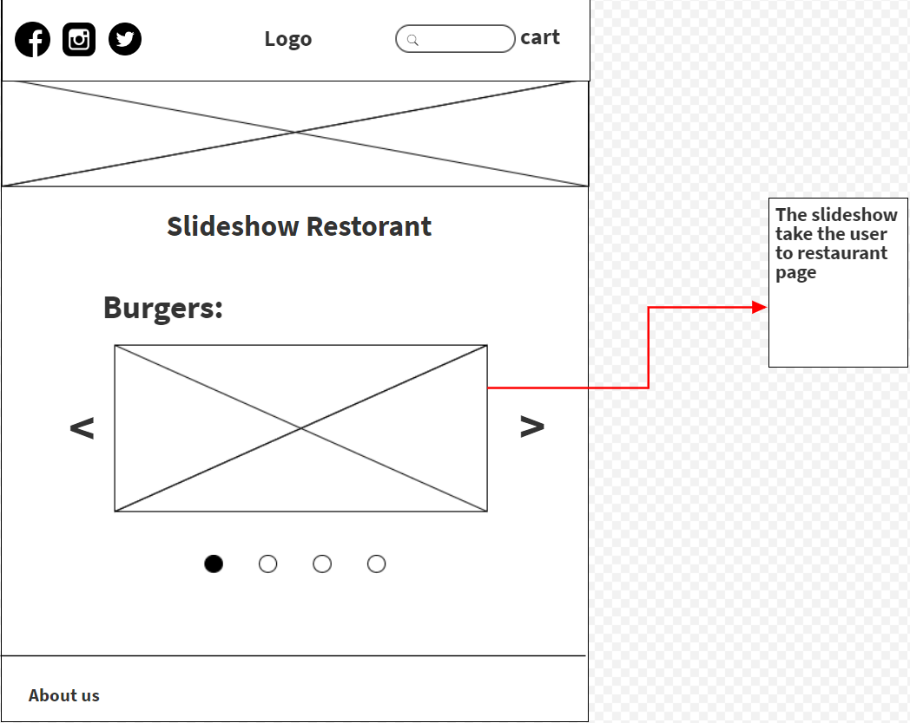
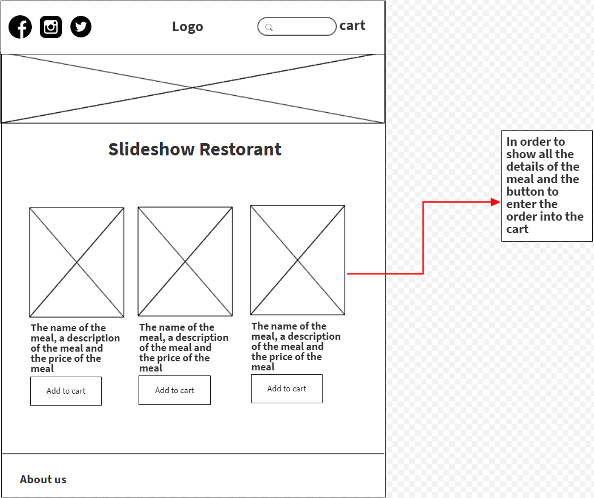
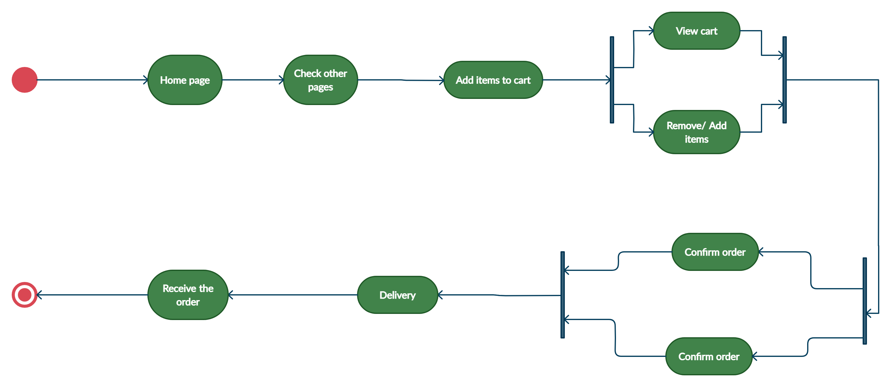

# FOODIE
## Team Members:
Hesham Hassan, Ali Mwase, Ammar Ramadan, Bashar Owainat, Leen Barakat
## The idea for our project:
In Jordan, we do not have many web pages for ordering food online, so we decided to create a web page that brings restaurants in one place to facilitate the food ordering process. Competitive delivery charges against competitors.

## Overall problem scope:
 Create a cart to add all items (meals) to show all details dill like (meals price, sales tax, meals name, total price of all orders, .... etc). To do this, we want to store all order details in local storage on the cart page and show the invoice details on the cart page. And don't forget to create athour pages home page and restaurant pages to make it easier for the user.

 ### Wireframe:
Home page

Resturant page

## Activity Diagram
